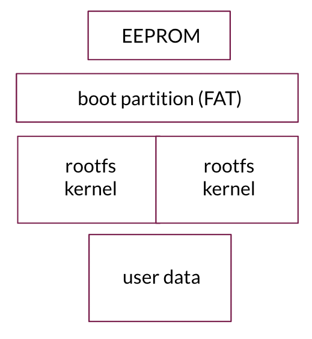

Mender is a client-server solution. Current version allows image based updates with automatic rollback if an update fails.

## Client requirements

The client needs to run on every device that you want to manage with Mender. 

###Yocto Project
Although it is possible to compile and install Mender independently, we have optimized the installation experience for those who build their Linux images using [Yocto Project](https://www.yoctoproject.org?target=_blank).

###Device capacity
The client binaries, which are written in Go, are around 7 MiB in size. 

Our reference board, the [BeagleBone Black](http://beagleboard.org/bone?target=_blank), comes with a 1 GHz ARM Cortex-A8 processor, with 512 MiB of RAM. We use these boards in our continuous integration process.

###Bootloader support
Mender integrates with the bootloader of the device. Currently we support the popular [U-Boot](http://www.denx.de/wiki/view/DULG/UBootBootCountLimit?target=_blank). Besides any special configuration to support the device, U-Boot needs to be compiled and used with the following features:

* [Boot Count Limit](http://www.denx.de/wiki/view/DULG/UBootBootCountLimit?target=_blank). It enables specific actions to be triggered when the boot process fails a certain amount of attempts.
* ext2/3/4 load support (specifically: the file system type of the rootfs). U-Boot needs this capability because the kernel will be stored there.

Support for modifying U-Boot variables from userspace is also required so that fw_printenv/fw_setenv utilities are available in userspace. These utilities can be 
[compiled from U-Boot sources](http://www.denx.de/wiki/view/DULG/HowCanIAccessUBootEnvironmentVariablesInLinux?target=_blank) and are part of U-Boot.

###Kernel support
While Mender itself does not have any specific kernel requirements beyond what a normal Linux kernel provides, it relies on systemd, which does have one such requirement: The `CONFIG_FHANDLE` feature must be enabled in the kernel. The symptom if this feature is unavailable is that systemd hangs during boot looking for device files.

###Device partitioning
At least four different partitions are required, one of which is the boot partition, two partitions where both the kernel and rootfs are stored, and one which holds user data.

One of the partitions will be used as active partition, from which the kernel and rootfs will be booted, the second one will be used by the update mechanism to write the updated image. The second of these two partitions will be referred to as "inactive" later in this document.

The user data partition stores persistent data, so this does not get overwritten during an update.

A sample partition layout is shown below:

## Server requirements

The server consists of various backend services to be installed locally. These services have not yet been released, but they are designed as micro-services with a polling mechinism so the server requirements will depend greatly on the number of devices that is managed.