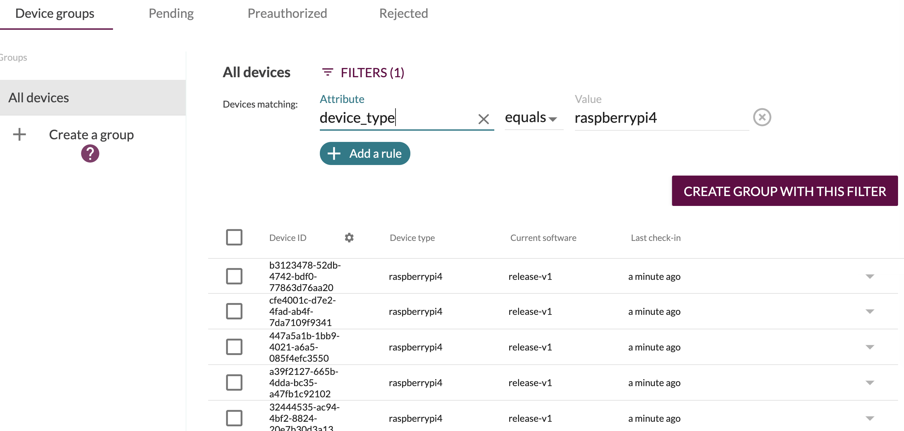

With Mender, you can manage large number of devices. It would be impractical
to do it on a single device basis, hence we introduce the concept of device
grouping. There are two types of groups: _static_ and _dynamic_.

## Static group

A *static group* contains a list of [Device IDs](../15.Taxonomy/docs.md).
You can add devices to a static group in the UI or using the
[APIs](../../06.Server-integration/01.Using-the-apis/docs.md).

Some considerations when working with static groups:
* Before you can add a device to a static group, it needs to be
  [Accepted](../15.Taxonomy/docs.md) on the Mender server.
* A device can only exist in one static group.
* A static group only exists as long as there is at least one device in it.

The following picture shows the devices view with three static groups defined:

## Dynamic group

A *dynamic group* does not contain a list of predefined
[Device IDs](../15.Taxonomy/docs.md). It instead contains the definition of a
filter that can match one or more devices, and the matched devices may change
in the future as you accept new devices into Mender, or device attributes change
and fulfill the filter criteria.

The following picture shows the definition of a filter that you can save as a
dynamic group:

## Groups and updates to devices

You can use device groups for more than just viewing purposes. Their primary function
is to serve as the target of deployments.

!!! Deployments to dynamic groups behave differently than deployments to static
!!! groups, see [Deployment section](../04.Deployment/docs.md) for more
!!! information.
