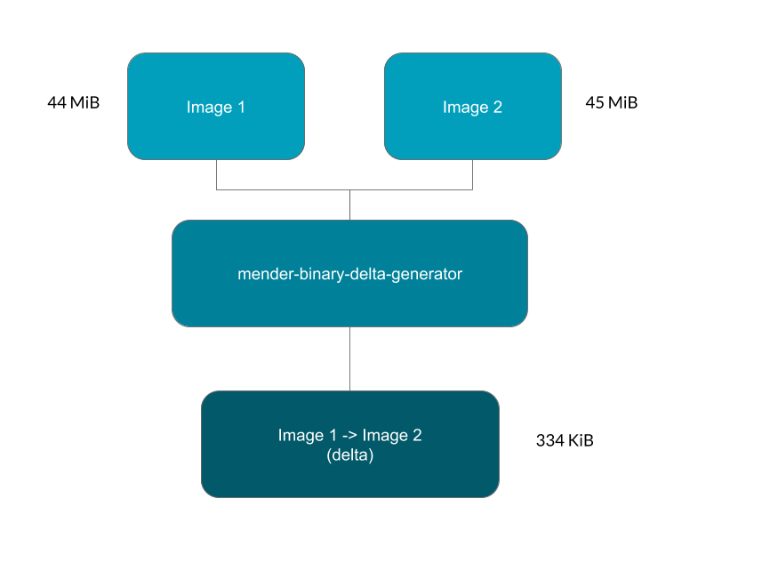

!!! Support for Delta updates is available in the Mender Enterprise plan and
!!! partially in Mender Professional. See
!!! [the Mender features page](https://mender.io/plans/features?target=_blank)
!!! for an overview of all Mender plans and features.

Delta updates provide significant savings in both bandwidth and install time.
When you use delta updates, only the difference between the new and the old root
filesystem is transmitted to the device. A delta update can therefore be
significantly smaller than a regular update. In every other regard, this is the
same as doing a regular system update, with atomicity, integrity, rollback and
signature support included.

Installation of delta updates is in general faster because only the changed
blocks are written instead of the whole update.

When a device checks for an update, the Mender server will automatically assign
the right Artifact to the device based on the version the device is running
already. It will select a delta update if available (i.e. has been generated)
for the release the device is running, but also supports falling back to the
full image if no delta update is available for a given device.

This ensures that all devices get updated and minimizes the bandwidth needed
(based on the delta updates that are available in the server).

To learn more about how to integrate robust delta updates visit the
[Mender Hub - Robust delta update rootfs](https://hub.mender.io/t/robust-delta-update-rootfs/1144?target=_blank)

