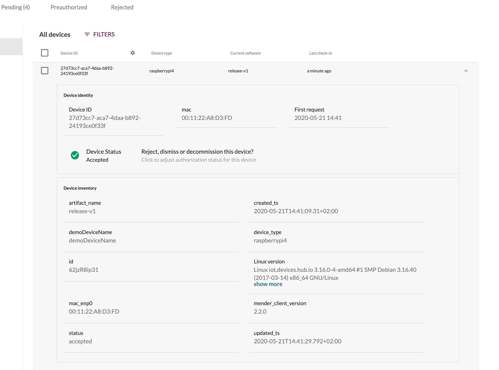

## Introduction

Unlike [Device identity attributes](../07.Identity/docs.md), Device inventory attributes
do not need to be unique. They simply provide information about the target device.

The Mender client will periodically collect inventory-related data for reporting
to the Mender server. Executable files, stored in a known location, will be
invoked by the Mender client, producing the inventory data as a set of key-value
pairs.

When you log in to mender server UI and navigate to the device list, among other items,
you can see certain pieces of data associated with each device. Those can be
a hostname, IP address, or any key-value pair you can think of. For further details,
please refer to the [client installation section](../../03.Client-installation/04.Inventory/docs.md).

## Usage

The Mender server stores information about each device in the form of key-value pairs
called *attributes* grouped in *scopes*. The inventory attributes belong
to *inventory* scope which also denotes the ownership of data; the device
"owns" the inventory data in a sense that it can overwrite the attributes
in the scope at will.

Some considerations while working with inventory attributes:
* Inventory attributes are _not_ unique identifiers of a device.
* Inventory attributes are pieces of data associated with a device that the client
  sends to the server for use in API calls or for sorting, filtering and searching
  in the UI.
* The client sends the attributes at regular intervals
  (configurable with [InventoryPollIntervalSeconds](../../03.Client-installation/07.Configuration-file/50.Configuration-options/docs.md#InventoryPollIntervalSeconds)).
* The server updates all attributes sent by the client.

The following screenshot shows an example set of inventory data in the expanded view
of a device.

### Inventory attribute use cases

The inventory attributes mechanism allows you to publish to the Mender server every
piece of data that is important for your usage and that can be expressed as
key-value pairs. Later you can use these attributes to create filters, dynamic groups,
and to search for devices.

Examples use cases:
* Information related to the installation of the device
  * Site information
  * Location information
  * Project information
  * Customer information
* IP address
  * useful if you have VPN connections enabled, this could be a way to look up local IP address on the VPN network

### Customizing Inventory

Adding more inventory fields, such as the kernel version or total available
memory, is easy to do and Mender supports it well. Then you can use the inventory
fields to create Dynamic groups (see the screenshot below).

For more information on customizing the Inventory attributes,
please refer to the [client configuration section](../../03.Client-installation/04.Inventory/docs.md).

!! Currently, there is one "_reserved_" attribute in the *identity* scope: _status_.
!! It stores the status (`accepted`, `rejected`, etc.) of a device and changes whether
!! the device status changes. Therefore, you cannot modify it directly.

