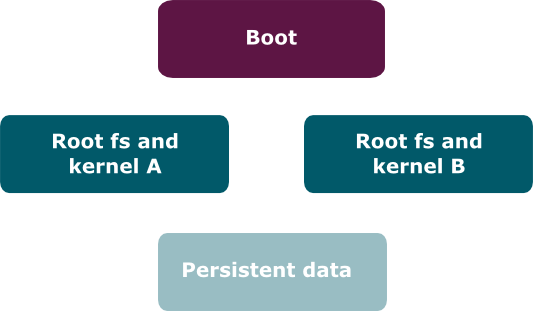

##Overview

In order to support robust rollback, Mender requires the device to have a certain partition layout. At least four different partitions are required, one of which is the boot partition, two partitions where both the kernel and rootfs are stored, and one which holds user data.

One of the partitions will be used as active partition, from which the kernel and rootfs will be booted, the second one will be used by the update mechanism to write the updated image. The second of these two partitions is referred to as the "inactive" partition.

The user data partition stores persistent data, so this does not get overwritten during an update.

A sample partition layout is shown below:

##Configuring the partition sizes

When [building a Mender Yocto Project image](../../Artifacts/Building-Mender-Yocto-image) Mender defines and uses certain OpenEmbedded variables which are used to define the sizes of the partitions. They are defined in `meta-mender` under `classes/mender-sdimg.bbclass`.

| Mount point | Purpose                                                 | Default size | Variable to configure size |
|-------------|---------------------------------------------------------|--------------|----------------------------|
| `/`         | Store the root filesystem and kernel.                   | N/A          | `IMAGE_ROOTFS_SIZE`        |
| `/uboot`    | Store the bootloader.                                   | 16 MB        | `SDIMG_BOOT_PART_SIZE_MB`  |
| `/data`     | Store persistent data, preserved during Mender updates. | 128 MB       | `SDIMG_DATA_PART_SIZE_MB`  |

You can override these default values in your `local.conf`.

##Preserving data and configuration across updates

As Mender does a full rootfs image update, care must be taken in where persistent data is stored. The contents of the partition mounted on `/data` is preserved across updates. In fact, the Mender client itself uses `/data/mender` as a backing to store data that needs to be kept across updates.

If you have data or configuration that you need to preserve across updates, the recommended approach is to create a symlink from where it gets written to somewhere within `/data/`. For example, if you have an application that writes to `/etc/application1`, then you can create a symlink `/etc/application1` -> `/data/application1` to ensure the data it writes is not lost during a Mender rootfs update.
