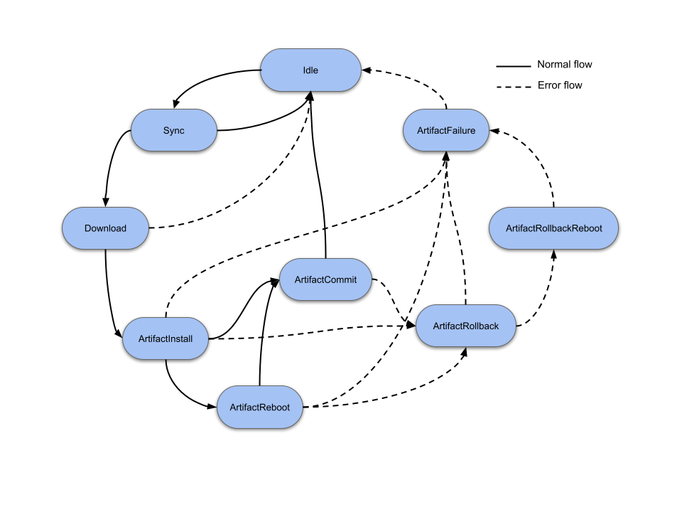
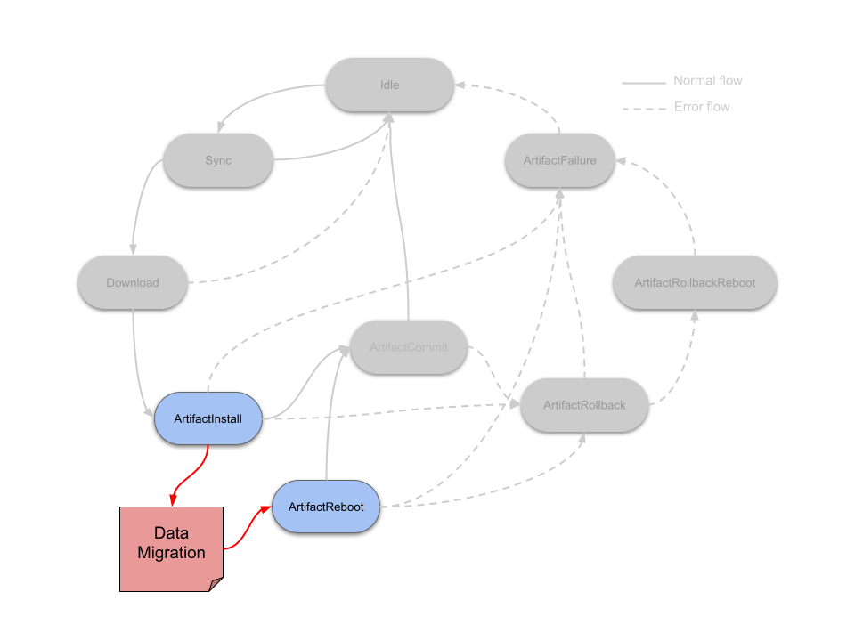
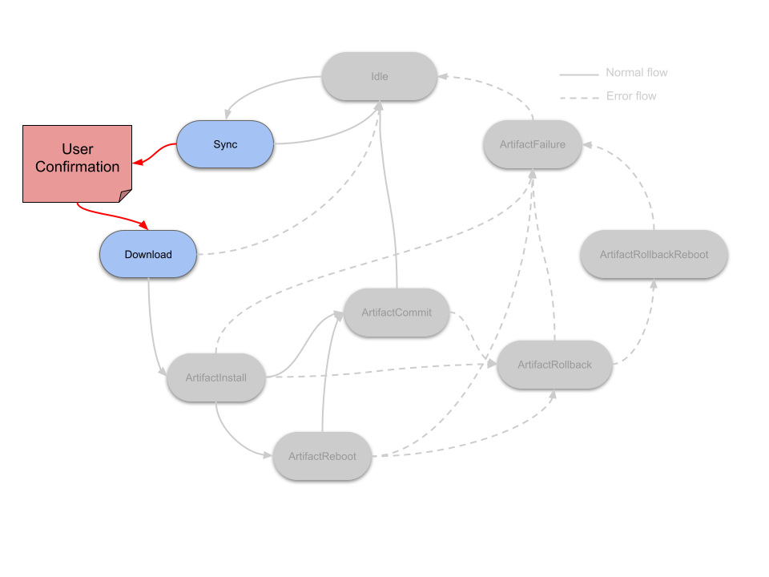
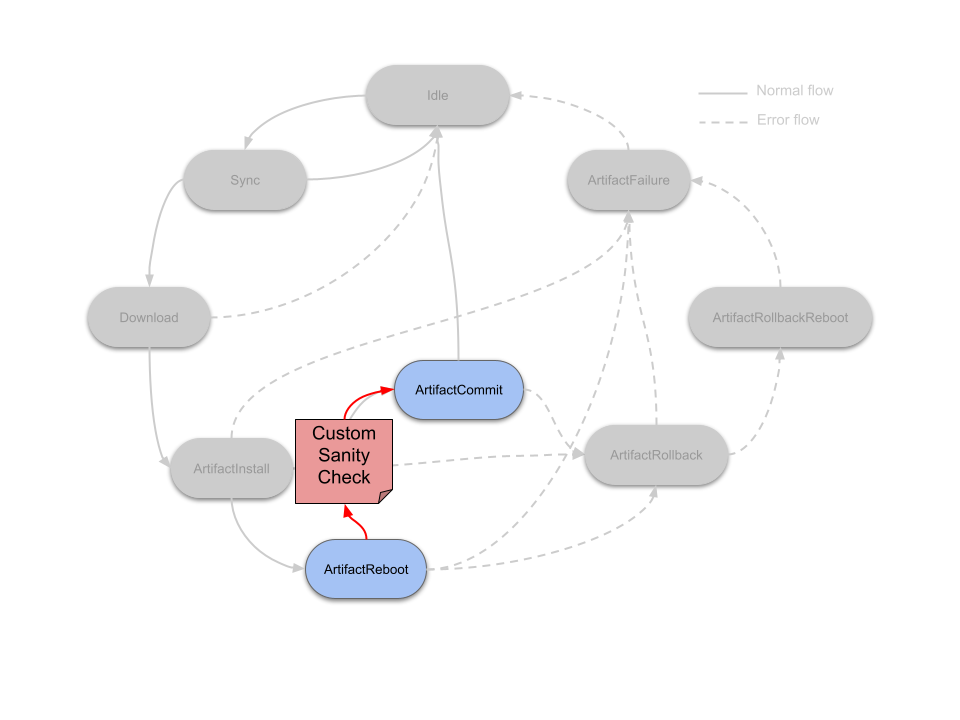
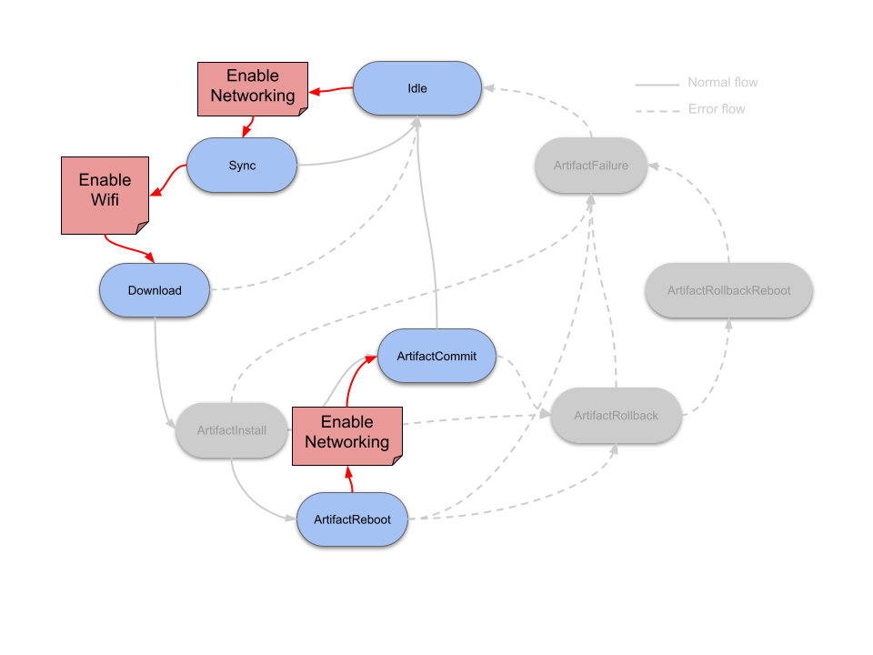

The Mender Client has the ability to run pre- and postinstall scripts, before and after it writes the root file system. However, Mender state scripts are more general and useful than pre/postinstall scripts because they can be run between *any* state transition, not just (before/after) the install state. For some examples of usage, see [example use cases](#example-use-cases).


## The nine states

Starting with the Mender Client version 1.2, support is available for scripts to be run before and after nine different states:

* **Idle**: this is a state where no communication with the server is needed nor is there any update in progress
* **Sync**: communication with the server is needed (currently while checking if there is an update for the given device and when inventory data is sent to server)
* **Download**: there is an update for the given device and a new Artifact is downloaded
* **ArtifactInstall**: the Artifact is being installed
* **ArtifactReboot**: runs if the Artifact being installed requires a reboot. Not all Artifact types do, but rootfs-image Artifacts will always reboot. The Enter actions run before the reboot; the Leave actions run after.
* **ArtifactCommit**: device is up and running after rebooting, and the commit makes the update persistent
* **ArtifactRollback**: if the new update is broken and we need to go back to the previous one
* **ArtifactRollbackReboot**: if we need to reboot the device after performing rollback
* **ArtifactFailure**: if any of the "Artifact" states are failing, the device enters and executes this state. This state always runs after the ArtifactRollback and ArtifactRollbackReboot states.

State scripts can either be run as we transition into a state; "Enter", or out from a state, "Leave". Most of the states also have an "Error" transition which is run when some error occurs while executing any action inside the given state (including execution of Enter and Leave scripts).



### Standalone mode

If Mender is used in standalone mode (installing via command line), some states are omitted from execution because Mender is not running as a daemon. These are the states that are executed in standalone mode:

* **Download**
* **ArtifactInstall**
* **ArtifactCommit**
* **ArtifactRollback**
* **ArtifactFailure**


## Root file system and Artifact scripts

There are two types of the state scripts: root file system and Artifact. The root file systems scripts are stored as a part of the current root file system. The default location
for those scripts is `/etc/mender/scripts`.
The Artifact scripts are part of the Artifact and are delivered to the Client inside the Artifact. All the Artifact scripts are prefixed with `Artifact`.

The reason for having both root file system and Artifact scripts is related to the fact that some scripts must run before the Client downloads the Artifact and as such can not be delivered with the Artifact. Those scripts are Idle, Sync and Download. Therefore it is important to remember that when deploying a new update, all scripts will be run from the currently running root file system until ArtifactInstall, at which point the scripts from the new Artifact will take over.


## Transitions and ordering

State scripts are run by the Mender Client after reaching a given state. Before entering the new state the Enter scripts are run. After all the actions belonging to the given state are executed, the Leave scripts are run. For most of the states, if some error occurs while executing either an Enter or a Leave script, or some action inside the state (like installing a new artifact which is broken and therefore installation is failing) the corresponding Error scripts are executed.
The exceptions are Idle, Sync, ArtifactRollback, ArtifactRollbackReboot and ArtifactFailure. The reason for ignoring errors and not calling Error scripts is that the state is already an error state, such as for example ArtifactRollback.

There can be more than one script for a given state. Each script contains an ordering number as a part of the naming convention, which determines when it is run:

```
<STATE_NAME>_<ACTION>_<ORDERING_NUMBER>_<OPTIONAL_DESCRIPTION>
```

For example, `Download_Enter_05_wifi-driver` and `Download_Enter_10_ask-user` are both run before the `Download` state, and the `wifi-driver` script would run before the `ask-user` script. The ordering between the states depends on the outcome of the states run, please see [state transition ordering](#state-transition-ordering) for the most common cases.

**There are no arguments passed to the scripts.**


## Script return codes

If a script returns `0` Mender proceeds, but if it returns `1` the update is aborted and rolled back.
In addition, return code `21` is used for the [retry-later](#retry-later) feature.
All other return codes are reserved for future use by Mender and should not be used.

### Retry-later

State scripts are allowed to return a specific error code (`21`), in which case the client will sleep for a time configured by [StateScriptRetryIntervalSeconds](../../03.Client-installation/06.Configuration-file/50.Configuration-options/docs.md#statescriptretryintervalseconds) before the state script is called again. Note that scripts are not allowed to retry for infinitely long. Please see description of [StateScriptRetryTimeoutSeconds](../../03.Client-installation/06.Configuration-file/50.Configuration-options/docs.md#statescriptretrytimeoutseconds) for more information.

This feature is useful e.g when you want user confirmation before proceeding with the update as is described in the [Update confirmation by end user](#update-confirmation-by-end-user) section on this page.

## Script timeout

Each script has a maximum execution time defined by [StateScriptTimeoutSeconds](../../03.Client-installation/06.Configuration-file/50.Configuration-options/docs.md#statescripttimeoutseconds). If a script exceeds this running time, its process group will be killed and the Mender client will treat the script and the update as failed.

## Power loss

In general power loss means that Mender will transition into an error state, either ArtifactRollback or ArtifactFailure, depending on the level of rollback support of the Payload types in the Artifact. If a power loss happens inside one of the error states, that state will be repeated until it succeeds without a power interruption. However, there are some exceptions: Power loss is allowed to happen within any Reboot state, since it may be indistinguishable from a normal reboot. Also `ArtifactCommit_Leave` will be repeated just like the error states, since after committing it is too late to do a rollback.

!!! Tip: Since a power loss in `ArtifactReboot_Enter` will not be marked as a failure, this enables the user to stall the daemon in `ArtifactReboot_Enter` state forever, and thus an install will only be installed on a power-cycle of the device.

Because of the possible re-execution described above, state scripts should be written to be idempotent. This means that re-running the script several times, even partially, should have the same effect as running it once, as long as the last execution is a complete one.

## State script logging

Mender captures the standard error (but not standard out) stream from
state scripts. The standard error stream from state scripts is stored
as part of the Mender deployment log, so it becomes available
[locally on the client](../../201.Troubleshooting/03.Mender-Client/docs.md#deployment-log-files)
as well as reported to the server (if the deployment fails) to ease diagnostics.

Thus the state scripts should be written so they output diagnostics
information to standard error, especially in case of failure
(returning 1). The maximum size of the log is 10KiB per state script,
anything above this volume will be truncated.

## Example use cases

Mender users will probably come up with a lot of interesting use cases for state scripts, and we will cover some well-known ones below for inspiration.

<!--AUTOVERSION: "mender/tree/%"/ignore-->
You can find code examples in the [Mender client source repository](https://github.com/mendersoftware/mender/tree/master/examples/state-scripts?target=_blank) and if you have implemented an interesting use-case we encourage you to create a pull-request so all of the community can benefit.

#### Application data migration
In this case, application data like a user profile is stored in an SQLite database and a new column need to be added before starting the new version of the application. This can be achieved by adding a state script to `ArtifactInstall_Leave` (that would run after writing the new rootfs, but before rebooting). This script can then do the necessary migrations on the data partition before the new version of the application is brought up after the reboot.




#### Update confirmation by end user
For many devices with a display that interacts with an end user, it is desirable to ask the user before applying the update. You have probably seen this on a smartphone, where it will ask you if you want to update to the latest release of Android or iOS and it only starts after you hit "Apply".

Mender state scripts enable this use case with a script written to create the dialog box on the UI framework used. The script will simply wait for user input, and Mender will wait with the update process while waiting for the script to finish. Depending on what the user selects, the script can return `0` (proceed) or `21` ([retry later](#retry-later)). For example, this script can be run in the `Download_Enter` state, and the user will be asked before the download begins. Alternatively, the script can also be run in the `Download_Leave` state, if you want the download to finish first, and the user only to accept installing the update and rebooting.

Make sure to adjust [StateScriptRetryTimeoutSeconds](../../03.Client-installation/06.Configuration-file/50.Configuration-options/docs.md#statescriptretrytimeoutseconds), to enable this use case.



!! Maximum wait time between `Sync` and `Download` state is 24 hours, after this period the update will be marked as failed by the Mender client. This happens because the Mender Artifact download link is generated in `Sync` state and it has a expiration time (24 hours).

#### Custom sanity checks after the update is installed
Mender already automatically rolls back an update if it can not reach the Mender Server after the update is installed, in order to ensure *another* update can be deployed.

Scripts in `ArtifactCommit_Enter` can do additional sanity checks to make sure that the device and applications are working as expected. For example, is the UI application running and responding within a given amount of time? If not, then the script can simply return 1 and Mender will roll back the update.




#### Enable network connectivity

In order to save power and bandwidth, network connectivity may not be enabled by default on the device, so you want to selectively enable it when needed.

A state script in `Sync_Enter` can enable network connectivity. You could also enable more powerful network connectivity, such as Wi-Fi, with a state script in `Download_Enter`. If the network is not brought up by default on reboot, you should also enable network in `Reboot_Leave`.

!!! Note that the `Sync_Enter` transition can be reached quite frequently, depending on the [polling intervals](../../03.Client-installation/06.Configuration-file/01.Polling-intervals/docs.md). The Mender Client also requires network in several following states of the update process to report progress to the Mender Server.

If you want to explicitly disable network again after Mender has finished the deployment, the only safe place to do this is in `Idle_Enter`.




## State transition ordering

You will find state transitions for common scenarios below.


#### Normal execution without errors

1. (device boot)
2. [Idle_Enter] Idle [Idle_Leave]
3. [Sync_Enter] Sync [Sync_Leave]
4. [Download_Enter] Download [Download_Leave]
5. [ArtifactInstall_Enter] ArtifactInstall [ArtifactInstall_Leave]
6. [ArtifactReboot_Enter] ArtifactReboot
7. (device reboot)
8. [ArtifactReboot_Leave]
9. [ArtifactCommit_Enter] ArtifactCommit [ArtifactCommit_Leave]
10. [Idle_Enter] Idle [Idle_Leave]

Please note that scripts in `ArtifactReboot_Leave` are run *after* the device has rebooted.


#### Error while downloading the Artifact

1. (device boot)
2. [Idle_Enter] Idle [Idle_Leave]
3. [Sync_Enter] Sync [Sync_Leave]
4. [Download_Enter] Download
5. (error while downloading)
6. [Download_Error]
7. [Idle_Enter] Idle [Idle_Leave]

Please note that no scripts in the `Download_Leave` transition are run if the download fails. Instead, the scripts in the `Download_Error` transition are run.


#### Error while installing the update

1. (device boot)
2. [Idle_Enter] Idle [Idle_Leave]
3. [Sync_Enter] Sync [Sync_Leave]
4. [Download_Enter] Download [Download_Leave]
5. [ArtifactInstall_Enter] ArtifactInstall
6. (error while installing)
7. [ArtifactInstall_Error]
8. [ArtifactRollback_Enter] ArtifactRollback [ArtifactRollback_Leave]
9. [ArtifactRollbackReboot_Enter] ArtifactRollbackReboot
10. (device reboot)
11. [ArtifactRollbackReboot_Leave]
12. [ArtifactFailure_Enter] ArtifactFailure [ArtifactFailure_Leave]
13. [Idle_Enter] Idle [Idle_Leave]

In case any of the `Artifact` scripts fail, an additional `ArtifactFailure` state is entered and the corresponding Enter and Leave scripts are run. Please also note that *there is no* `ArtifactFailure_Error` state transition and if any error occurs while executing actions inside the `ArtifactFailure` state, the scripts in the `ArtifactFailure_Leave` transition will run and an appropriate error path will be executed.


#### Error while committing an update

1. (device boot)
2. [Idle_Enter] Idle [Idle_Leave]
3. [Sync_Enter] Sync [Sync_Leave]
4. [Download_Enter] Download [Download_Leave]
5. [ArtifactInstall_Enter] ArtifactInstall [ArtifactInstall_Leave]
6. [ArtifactReboot_Enter] ArtifactReboot
7. (device reboot)
8. [ArtifactReboot_Leave]
9. [ArtifactCommit_Enter] ArtifactCommit
10. (error while committing)
11. [ArtifactCommit_Error]
12. [ArtifactRollback_Enter] ArtifactRollback [ArtifactRollback_Leave]
13. [ArtifactRollbackReboot_Enter] ArtifactRollbackReboot
14. (device reboot)
15. [ArtifactRollbackReboot_Leave]
16. [ArtifactFailure_Enter] ArtifactFailure [ArtifactFailure_Leave]
17. [Idle_Enter] Idle [Idle_Leave]

Please note that similar to the `ArtifactReboot` state, scripts in the `ArtifactRollbackReboot_Leave` transition are called after the device has rebooted.
